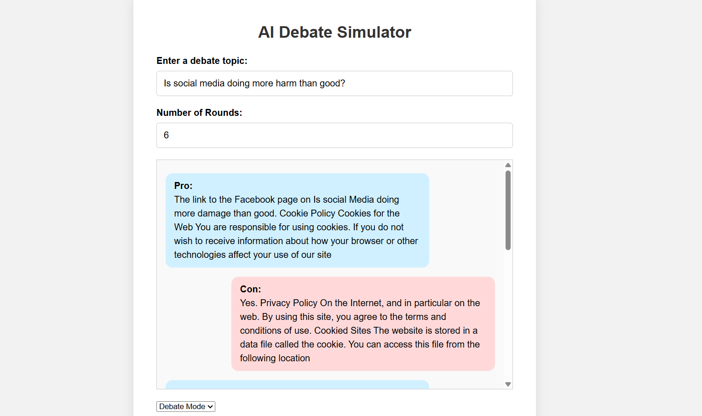

# AI-Debate-Simulator

AI-Debate-Simulator is an interactive debate simulation powered by AI. This project allows two AI agents to engage in a debate on a given topic. The agents take on opposing roles (Pro and Con) and generate responses based on the input topic.



## Features:
- **Debate Mode**: Simulates a debate with two AI agents taking opposing stances on a provided topic.
- **Chat Mode**: Allows for conversational interactions with the AI assistant.
- **Customizable Topics**: You can input any debate topic of your choice.
- **Round-based Debates**: The debate progresses through multiple rounds, alternating between Pro and Con responses.

## Requirements:
- Python 3.8
- Install the necessary dependencies with `pip`:

    ```bash
    pip install -r requirements.txt
    ```

## Installation:

1. Clone the repository:
    ```bash
    git clone https://github.com/tongyu0924/AI-Debate-Simulator.git
    ```

2. Navigate to the project directory:
    ```bash
    cd AI-Debate-Simulator
    ```

3. Install the required dependencies:
    ```bash
    pip install -r requirements.txt
    ```

4. Run the application:
    ```bash
    python app.py
    ```

5. Access the application in your browser at:
    ```
    http://127.0.0.1:5007
    ```

## How to Use:

### 1. **Debate Mode**:
   - Enter a topic for the debate (e.g., "Should governments impose an automation tax to fund unemployment benefits?")
   - Set the number of debate rounds.
   - Start the debate and watch the AI agents (Pro and Con) generate their arguments based on the topic.

### 2. **Chat Mode**:
   - Interact with the AI in a chat-based format. The AI will respond based on the context provided.

## Notes:
- The app uses **GPT-Neo** (125M) for generating text responses. If you have GPU support, the app will automatically run on it for faster performance. If no GPU is available, it will run on the CPU.

- You can modify the `app.py` file for additional customizations, such as adding more rounds or changing debate behaviors.

## License:
This project is open-source and available under the MIT License. See the LICENSE file for more details.

## Contact:
- **Creator**: [tongyu0924](https://github.com/tongyu0924)
