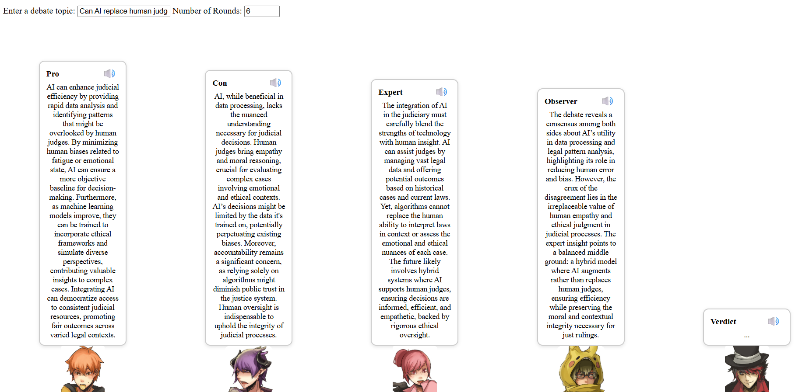

# Multi-Role Debate Simulator

AI-Debate-Simulator is an interactive debate simulation powered by AI. This project allows two AI agents to engage in a debate on a given topic. The agents take on opposing roles (Pro and Con) and generate responses based on the input topic.



## Features:
- **🧑‍🤝‍🧑 Multi-Role Debate Mode**  
  AI agents take on distinct roles (Pro, Con, Expert, Observer, Verdict) and simulate structured debates on user-defined topics.

- **💬 Chat Mode**  
  Switch to freeform conversation with a single assistant agent.

- **🪄 Verdict Agent with Team Memory**  
  A dedicated lead agent (`Verdict`) provides a final summary after all rounds. It leverages a focused memory buffer that excludes its own utterances.

- **⚡ Runtime Model Switching**  
  Seamlessly switch between a lightweight local model (GPT-Neo) or OpenAI’s GPT-4o — no need to restart the server.

- **📝 Custom Topics & Round Settings**  
  Users can define any debate topic and the number of rounds before initiating discussion.

- **🕰️ View Full Debate History**  
  Easily review all role messages via the UI's "View Full History" button.

- **🔁 Structured Turn-Based Flow**  
  Agents respond in a round-robin sequence to maintain dialogue coherence and role consistency.


## Roles and Their Functions

- **Pro**: Argues **in favor** of the topic, presenting supporting evidence and logical reasoning.
- **Con**: Argues **against** the topic, pointing out risks, flaws, or counterexamples.
- **Expert**: Provides **neutral and technical** insights to enrich the discussion without taking sides.
- **Observer**: Reflects on the overall debate with **meta-level commentary**, summaries, or critiques.
- **Verdict** (Lead Agent): Delivers a **final judgment or summary** after all rounds, using both the shared dialogue history and a focused team memory that contains only agent responses.

## Architecture Overview
Below is a high-level diagram of the system's modular architecture:
```
+-----------------------+
| Web Frontend (UI) |
+----------+------------+
|
v
+---------------------------+
| Flask Server |
| (Debate Orchestrator) |
+---------------------------+
|
v
+---------------------------+
| Debate Manager |
| - Turn Scheduling |
| - Topic Assignment |
| - Verdict Invocation |
+---------------------------+
|
v
+-------------------------------------------+
| DebateAgent Instances |
| +--------+ +------+ +---------+ |
| | Pro | | Con | | Expert | ... |
+-------------------------------------------+
|
v
+-------------------------------------------+
| Shared Memory Buffers |
| - long_term_memory (for all agents) |
| - verdict_memory (for lead agent only) |
+-------------------------------------------+
|
v
+-------------------------------------------+
| LLM Backends (Hot-Swappable) |
| - GPT-Neo (Local) |
| - OpenAI GPT-4o (API) |
+-------------------------------------------+
```

## Architecture & Design

This project is inspired by [agent-squad](https://github.com/awslabs/agent-squad), a multi-agent coordination framework.

It uses a **modular, turn-based architecture** with the following components:

- **Role-Based Agent Modeling**  
  Each agent is assigned a distinct role (Pro, Con, Expert, Observer, Verdict) and generates replies according to predefined behavioral instructions.

- **Shared Long-Term Memory**  
  All utterances are stored in a global memory buffer. This shared memory is passed to every agent as dialogue context to ensure continuity across turns.

- **Lead Agent with Team Memory**  
  A dedicated lead agent (`Verdict`) summarizes the debate at the end. In addition to shared memory, it accesses a specialized **team memory** (`verdict_memory`) that accumulates only the statements from other agents — giving it a focused view for summarization or judgment.

- **Model Abstraction Layer**  
  Each agent can run on either a local model (GPT-Neo) or OpenAI’s GPT-4o. Models can be hot-swapped at runtime without restarting the server.

- **Debate Manager**  
  Orchestrates agent turns in a round-robin fashion. After the final round, it invokes the `Verdict` agent to provide a conclusion.

- **Extensibility**  
  The system supports further improvements such as:
  - Injecting user notes into lead agent context
  - Memory compression or retrieval augmentation
  - Multi-lead hierarchical structures
  - Integration with tools or search APIs

This architecture enables experimentation with multi-agent reasoning, memory separation, and lead-driven summarization.

## Requirements:
- Python 3.8
- Install the necessary dependencies with `pip`:

    ```bash
    pip install -r requirements.txt
    ```

## Installation:

1. Clone the repository:
    ```bash
    git clone https://github.com/tongyu0924/AI-Debate-Simulator.git
    ```

2. Navigate to the project directory:
    ```bash
    cd AI-Debate-Simulator
    ```

3. Install the required dependencies:
    ```bash
    pip install -r requirements.txt
    ```

4. Run the application:
    ```bash
    python app.py
    ```

5. Access the application in your browser at:
    ```
    http://127.0.0.1:5009
    ```

## How to Use:

### 1. **Debate Mode**:
   - Enter a topic for the debate (e.g., "Should governments impose an automation tax to fund unemployment benefits?")
   - Set the number of debate rounds.
   - Start the debate and watch the AI agents (Pro and Con) generate their arguments based on the topic.

### 2. **Chat Mode**:
   - Interact with the AI in a chat-based format. The AI will respond based on the context provided.

## Notes:
- The app supports two models: a **local model (GPT-Neo 125M)** and **GPT-4o via OpenAI API**.
- By default, it runs locally using GPT-Neo. If a GPU is available, it will be used automatically; otherwise, it will fall back to CPU.
- For higher-quality responses, you can switch to GPT-4o by providing your OpenAI API key (see section below).
- You can modify the `app.py` file to adjust the number of debate rounds, change generation settings, or customize behaviors.

## Using GPT-4o via OpenAI API:

By default, the app uses a lightweight local model (**GPT-Neo 125M**).  
To use **GPT-4o** via the OpenAI API instead, you can set your API key in one of two ways:

### Option 1: Use Environment Variable
Before running the app, set the `OPENAI_API_KEY` environment variable:

```bash
export OPENAI_API_KEY=your-api-key-here  # macOS/Linux
# set OPENAI_API_KEY=your-api-key-here  # Windows
```

### Option 2: Use Runtime API

While the app is running, you can switch models dynamically by calling the following API endpoint:

**POST** `/set_model`

To switch to **GPT-4o** (OpenAI API):

```bash
curl -X POST http://127.0.0.1:5009/set_model \
  -H "Content-Type: application/json" \
  -d '{"model": "openai", "api_key": "sk-your-api-key-here"}'
```

To switch back to the local model (GPT-Neo):
```bash
curl -X POST http://127.0.0.1:5009/set_model \
  -H "Content-Type: application/json" \
  -d '{"model": "local"}'
```

Once the model is set, all subsequent requests to /debate and /chat will use the selected model without restarting the server.

## License:
This project is open-source and available under the MIT License. See the LICENSE file for more details.

## Contact:
- **Creator**: [tongyu0924](https://github.com/tongyu0924)
