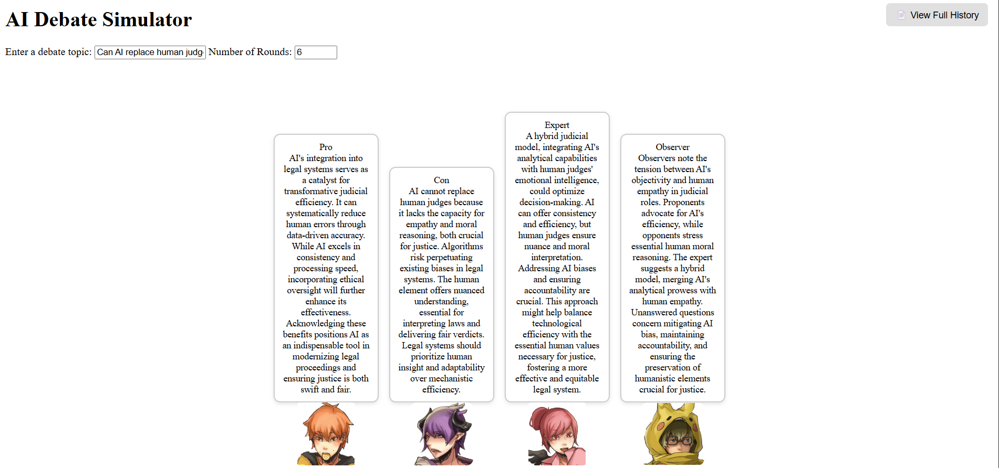

# AI-Debate-Simulator

AI-Debate-Simulator is an interactive debate simulation powered by AI. This project allows two AI agents to engage in a debate on a given topic. The agents take on opposing roles (Pro and Con) and generate responses based on the input topic.



## Features:
- **Debate Mode**: AI agents simulate structured debates based on user topics.
- **Chat Mode**: General-purpose conversation mode with the AI.
- **Model Selection**: Choose between a lightweight local model or powerful OpenAI API (gpt-4o).
- **Custom Topics**: Provide any topic you'd like the AI to debate.
- **Round-based Structure**: The system alternates speakers across debate rounds.

## Requirements:
- Python 3.8
- Install the necessary dependencies with `pip`:

    ```bash
    pip install -r requirements.txt
    ```

## Installation:

1. Clone the repository:
    ```bash
    git clone https://github.com/tongyu0924/AI-Debate-Simulator.git
    ```

2. Navigate to the project directory:
    ```bash
    cd AI-Debate-Simulator
    ```

3. Install the required dependencies:
    ```bash
    pip install -r requirements.txt
    ```

4. Run the application:
    ```bash
    python app.py
    ```

5. Access the application in your browser at:
    ```
    http://127.0.0.1:5009
    ```

## How to Use:

### 1. **Debate Mode**:
   - Enter a topic for the debate (e.g., "Should governments impose an automation tax to fund unemployment benefits?")
   - Set the number of debate rounds.
   - Start the debate and watch the AI agents (Pro and Con) generate their arguments based on the topic.

### 2. **Chat Mode**:
   - Interact with the AI in a chat-based format. The AI will respond based on the context provided.

## Notes:
- The app supports two models: a **local model (GPT-Neo 125M)** and **GPT-4o via OpenAI API**.
- By default, it runs locally using GPT-Neo. If a GPU is available, it will be used automatically; otherwise, it will fall back to CPU.
- For higher-quality responses, you can switch to GPT-4o by providing your OpenAI API key (see section below).
- You can modify the `app.py` file to adjust the number of debate rounds, change generation settings, or customize behaviors.

## Using GPT-4o via OpenAI API:

By default, the app uses a lightweight local model (**GPT-Neo 125M**).  
To use **GPT-4o** via the OpenAI API instead, you can set your API key in one of two ways:

### Option 1: Use Environment Variable
Before running the app, set the `OPENAI_API_KEY` environment variable:

```bash
export OPENAI_API_KEY=your-api-key-here  # macOS/Linux
# set OPENAI_API_KEY=your-api-key-here  # Windows
```

### Option 2: Use Runtime API

While the app is running, you can switch models dynamically by calling the following API endpoint:

**POST** `/set_model`

To switch to **GPT-4o** (OpenAI API):

```bash
curl -X POST http://127.0.0.1:5009/set_model \
  -H "Content-Type: application/json" \
  -d '{"model": "openai", "api_key": "sk-your-api-key-here"}'
```

To switch back to the local model (GPT-Neo):
```bash
curl -X POST http://127.0.0.1:5009/set_model \
  -H "Content-Type: application/json" \
  -d '{"model": "local"}'
```

Once the model is set, all subsequent requests to /debate and /chat will use the selected model without restarting the server.

## License:
This project is open-source and available under the MIT License. See the LICENSE file for more details.

## Contact:
- **Creator**: [tongyu0924](https://github.com/tongyu0924)
